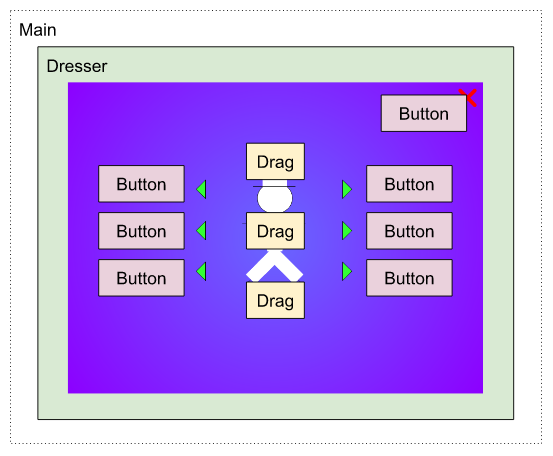

# Эволюция игрового фреймворка. Клиент 4. Вложенные компоненты

Так как вся логика сейчас, весь функционал находится в компонентах, то компонент является основной клеточкой нашего приложения. Эти простые клеточки можно объединять в "ткани" и составлять из них весь организм приложения. И это тоже будут компоненты. Таким образом, в Main мы создаем всего один корневой компонент для приложения, а он уже строит всю разветвленную иерархию вложенных компонентов.



Чтобы умело управлять этой иерархией нужно добавить в класс Component несколько новых свойств и методов.

## Свойство parent

[Ранее](01_client_03.md) мы уже обнаружили полезность хранения в компоненте всех его дочерних элементов (children). Это дает нам возможность, например, автоматически устанавливать и очищать в них скины. (Достаточно лишь задать свойство skinPath.) Но имея одно только свойство children, мы можем двигаться лишь вниз по иерархии. Чтобы иметь возможность перемещаться также и в обратном направлении, нам нужно сохранять ссылку и на непосредственного своего родителя. У родителя будет ссылка на своего родителя и так далее. Так, по цепочке мы сможем добраться прямо до корневого элемента всей структуры.

```haxe
class Component
{
    public var parent(default, null):Component;
    public var children(default, null):Array<Component> = [];
    // To prevent changing children directly
    //private var _children:Array<Component> = [];
    //public var children(get, null):Array<Component>;
    //public function get_children():Array<Component>
    //{
    //    return _children.copy();
    //}
    //...
    public function addChild(child:Component):Component
    {
        if (child.parent == this || child == this)
        {
            return null;
        }
        // Remove from previous
        if (child.parent != null)
        {
            child.parent.removeChild(child);
        }
        // Add
        child.parent = this;
        children.push(child);
        //_children.push(child); // Use if children getter returns copy
        return child;
    }
    public function removeChild(child:Component):Component
    {
        if (child.parent != this || child == this)
        {
            return null;
        }
        child.parent = null;
        children.remove(child);
        //_children.remove(child); // Use if children getter returns copy
        return child;
    }
}
```

## Методы addChild и removeChild

Так как добавление и удаление дочерних компонентов выполняется теперь не в одну (`children.push(child)`), а в несколько операций, то создадим специальные методы addChild() и removeChild(). Тогда добавление и удаление компонентов будет по-прежнему производится всего за один шаг.

Сюда же можно добавить кое-какие проверки, чтобы предотвратить, насколько это возможно, разные случаи неправильного использования класса. Например, если добавляется компонент, который уже был ранее добавлен в другой, то его нужно сначала удалить из предыдущего. В addChild() для этого есть проверка `if (child.parent != null)` и вызов `child.parent.removeChild(child);`. Благодаря этому у нас не получится так, что какой-то компонент одновременно будет находится в нескольких родителях.

Также, чтобы избежать возможности изменять `children` в обход методов `addChild()` и `removeChild()`, и тем самым нарушать логику работы компонентов, можно `children` сделать геттером, в котором будет возвращаться не сам список, а его копия: `children.copy()`. Изменения копии никак не повлияют на оригинал и, соответственно, не затронут внутреннего состояния компонента. Однако, пока что мы не станем этого делать и оставим так, как есть. Во-первых, скорость выполнения нам важнее, а во-вторых, допустим маловероятным, что кто-то будет делать такую глупость, как ручное изменение массива `children`.

Итак, с этого момента мы должны все компоненты при создании добавлять в другой компонент. Желательно всегда в тот, в котором он и создавался:

```haxe
class Dresser extends Component
{
    //...
    public function new(?skin:DisplayObject, ?assetName:String)
    {
        closeButton = new Button();
        closeButton.skinPath = "closeButton";
        closeButton.clickHandler = closeButton_clickHandler;
        addChild(closeButton);
        super(skin, assetName);
    }
    //...
}
```

## Создание компонентов по скину

Количество кнопок закрытия (closeButton) нам заранее известно — 1, поэтому мы заранее можем создать компонент для него еще в конструкторе. Но количество одежек в Dress-Up-играх может варьироваться от игры к игре. А значит, мы вынуждены создавать компоненты, исходя из текущего скина. Следовательно, этот код должен располагаться в `assignSkin()`. Так, вложенные компоненты могут создаваться в двух местах: если они известны заранее, то в конструкторе, а если зависят от скина — то в `assignSkin()`.

```haxe
class Dresser extends Component
{
    private var drags:Array<Drag>;
    //...
    override private function assignSkin():Void
    {
        super.assignSkin();

        items = cast resolveSkinPathPrefix(itemPathPrefix);
        //...
        drags = [];
        for (item in items)
        {
            var drag = new Drag();
            drag.skin = item;
            addChild(drag);
            drags.push(drag);
        }
    }
    override private function unassignSkin():Void
    {
        for (drag in drags)
        {
            drag.skin = null;
            removeChild(drag);
        }
        //...
        items = null;

        super.unassignSkin();
    }
    //...
}
```

## Метод dispose

Тут можно внести еще пару усовершенствований. Во-первых, чтобы уничтожить компонент (в `unassignSkin()`) нам приходится выполнять два действия: очистка скина и удаление компонента из родителя. Одно действие уничтожения разбито на два шага, а это значит, что время от времени мы будем забывать прописать один из них. Из-за этого на ровном месте будут возникать обидные баги по невнимательности, которые не только тормозят разработку, но еще дико раздражают и выбивают из рабочего настроения.

Поэтому всегда пользуемся простым правилом: одно логическое действие — одна физическая функция. Устойчивое сочетание вызова `removeChild()` и `skin = null` фактически предопределяет появление нового метода — dispose():

```haxe
class Component
{
    //...
    public function dispose():Void
    {
        if (parent != null)
        {
            parent.removeChild(this);
        }
        skin = null;
        //for (child in children.copy())
        //{
        //    child.dispose();
        //}
    }
    //...
}
class Dresser extends Component
{
    //...
    override private function unassignSkin():Void
    {
        for (drag in drags)
        {
            drag.dispose();
        }
        drags = null;
        //...

        super.unassignSkin();
    }
    //...
}
```

В `dispose()` можно добавить и уничтожение всех дочерних компонентов (см. закомментированный код), но тогда его нельзя будет использовать повторно, ведь чтобы создать их заново, нужно вызвать конструктор, а это невозможно. Однако, когда мы вынесем создание дочерних компонентов из конструктора в отдельный метод инициализации, мы этот код раскомментируем.

## Автоматическое удаление компонентов

Во-вторых, хорошо бы, чтобы компоненты, созданные в `assignSkin()` автоматически удалялись в `unassignSkin()`. Тогда и список `drags` будет не нужен. Для этого можно перед вызовом `assignSkin()` устанавливать флаг `isAssigningSkin` в `true`, а после окончания вызова снова сбрасывать. Так мы наверняка можем знать, какие вызовы `addChild()` были произведены в конструкторе (`isAssigningSkin==false`), а какие в `assignSkin()` (`isAssigningSkin==true`). Все компоненты добавленные из `assignSkin()` помещаются дополнительно в массив `temporaryChildren`, все элементы которого будут удалены при вызове `unassignSkin()`.

 ```haxe
class Component
{
    private var isAssigningSkin = false;
    private var temporaryChildren:Array<Component> = [];
    //...
    public function set_skin(value:DisplayObject):DisplayObject
    {
        if (skin == value)
        {
            return value;
        }
        // Unassign previous skin
        if (skin != null)
        {
            unassignSkin();
        }

        skin = value;
        interactiveObject = Std.downcast(value, InteractiveObject);
        simpleButton = Std.downcast(value, SimpleButton);
        container = Std.downcast(value, DisplayObjectContainer);
        sprite = Std.downcast(value, Sprite);
        mc = Std.downcast(value, MovieClip);

        // Assign new skin
        if (skin != null)
        {
            isAssigningSkin = true;
            assignSkin();
            isAssigningSkin = false;
        }
        return value;
    }
    public function addChild(child:Component):Component
    {
        //...
        if (isAssigningSkin)
        {
            temporaryChildren.push(child);
        }
        return child;
    }
    //...
    private function unassignSkin():Void
    {
        // Clear up all children
        for (child in children.copy())
        {
            child.skin = null;
        }
        // Remove children added inside assignSkin()
        for (child in temporaryChildren.copy())
        {
            child.dispose();
        }
        temporaryChildren = [];
    }
}
```

Полезность этого нововведения очевидна — чем меньше нужно печатать руками, тем меньше ошибок можно допустить. А если так, то оно не только полезно, но еще и необходимо.

Налицо та же проблема. Одно логическое действие — добавление дочерних компонентов — требует выполнения двух физических операций: написание кода для создания и уничтожения компонентов. Сделав выполнение второй операции автоматическим, мы тем самым вернулись к правилу: одно действие — один вызов функции. Логика должна однозначно соответствовать коду — никакой раздвоенности.

В [следующей части](01_client_05.md) мы перейдем к практическому применению вложенных компонентов — к экранам (screens). Обкатав код на практике и внеся кое-какие изменения, мы создадим конечный вариант создания скинов.

[Исходники](https://gitlab.com/markelov-alex/hx-py-framework-evolution/)

[< Назад](01_client_03.md)  |  [Начало](00_intro_01.md)  |  [Вперед >](01_client_05.md)
