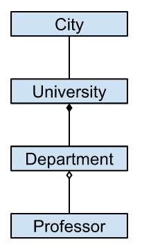

# Эволюция игрового фреймворка. Клиент 15. Логика

Пока что у нас вся логика находилась в компонентах (Component), что означает, что мы до сей поры не делали разделения между логикой отображения (view logic) и логикой предметной области (domain logic), или бизнес-логикой (business logic). То есть все изменения из предметной области или отображения производятся в одном и том же классе. Это еще ничего, если проектом занимается один человек, но если их несколько, то разделять полномочия в команде становится непросто. Да и сам класс может стать большим и запутанным.

Но это еще не единственная проблема. Если логики предметной области и отображения не разделены, то их нельзя в полном смысле слова вынести в библиотеку для повторного использования. Нельзя использовать в других проектах бизнес-логику или компоненты по отдельности, а только то и другое вместе. Также нельзя комбинировать между собой разные версии логики с разными версиями отображения.

Например, у нас есть компоненты по отображению шахматной доски и разных фигур на ней. На этой доске можно играть в шахматы, шашки, поддавки, уголки и множество других игр. Отображение состояния игры и передвижение элементов на доске — это логика отображения. Правила игры — это бизнес-логика. Если мы решим сделать несколько игр, так чтобы каждая помещалась только в одном классе, то логика отображения будет дублироваться в обоих.

Первая мысль — сделать отображение в базовом классе, а все классы с правилами должны от него наследоваться. Это уже прогресс. Но допустим, нам в одной из версии шахмат понадобилось добавить подсветку допустимых ходов для фигуры, или улучшить анимацию перемещения фигур. Т.е. нам нужно изменить логику отображения, которая находится в базовом классе. Придется снова всем играм наследоваться от нового отображения. Теперь дублируется код с бизнес-логикой.

Именно по этой причине наследование (subtyping) не является универсальным решением по отделению классов друг от друга. Его можно использовать только для родо-видовых связей, когда один класс органически и эволюционно вытекает из другого, неразрывно с ним связан. Как окунь связан с рыбами, а пчела с насекомыми. В остальных случаях применяется композиция объектов (object composition) — это когда один объект содержит ссылку на другой. Другими словами, subtyping — это когда один тип является одновременно и другим типом (is-a), а object composition — когда один тип содержит другой тип (has-a).

Отношение has-a бывает двух типов: сильное (strong has-a) и слабое (weak has-a). В первом случае объект, содержащий другие объекты, называется собственно композитом (composite), а во втором — агрегатом (aggregate). Хотя часто и то и другое также называют композитом. (Тут уже нужно смотреть на контекст: говорится ли в контексте разделения на композит и агрегат, или имеется в виду композит вообще.)

Сильное отношение означает полную и нераздельную ответственность композита за создание, хранение и удаление своих частей. Умирает композит — умирают и его части. Также объект-часть может хранится одновременно только в одном объекте-композите. Сюда относятся, например, отношения DisplayObjectContainer-DisplayObject и Component-Component. Оба этих случая являются примерами рекурентной композиции (Recursive composition). Это когда класс композита может иметь в качестве своих частей самого себя (DisplayObjectContainer наследуется от DisplayObject, а потому тоже является DisplayObject-ом). Такой тип называется рекурсивным ([Recursive type](https://en.wikipedia.org/wiki/Recursive_type)). Кроме того, так как DisplayObjectContainer и Component могут состоять из неопределенного количества своих частей, они также называются контейнерами ([Container])(https://en.wikipedia.org/wiki/Container_(abstract_data_type)).

В противоположность сильному has-a-отношению, при слабом отношении агрегат не отвечает за существование своих частей, так как они могут находится также и в других агрегатах — одновременно или в разное время. Примером может служить свойство skin в наших компонентах (отношение Component-DisplayObject): один и тот же скин может содержаться в нескольких компонентах. Но если скин создан данным компонентом (с помощью assetName), то и удален он должен быть тем же компонентом. Таким образом, skin воплощает в себе оба типа связи: если задан через assetName — сильной, если через skinPath — слабой.

В чистом виде агрегирование появляется в отношениях Component-Controller, Component-Model, Controller-Model. Но об этом после.

Физически, то есть в коде, оба отношения выражаются одинаково — свойством объекта. Разделение тут исключительно семантическое (смысловое), и происходит оно только в нашей голове. В коде же оно выражено тем, как данное свойство используется. Сначала решаем, какое отношение данное свойство выражает, а потом, держа это в голове, пишем весь остальной код.

На языке UML-диаграмм, где мы можем абстрагироваться от конкретного языка программирования, сильное has-a-отношение называется композицией (закрашенный ромбик), слабое — агрегированием (пустой ромбик), а неразличенное (т.е. если мы еще не решили, будет оно сильным или слабым) — ассоциацией (просто линия).

[Исходники](https://gitlab.com/markelov-alex/hx-py-framework-evolution/-/tree/main/f_models/client_haxe/src/)

[< Назад](01_client_14.md)  |  [Начало](00_intro_01.md)  |  [Вперед >](01_client_16.md)
