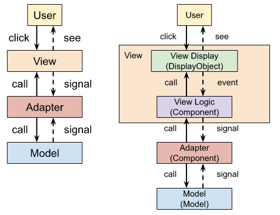
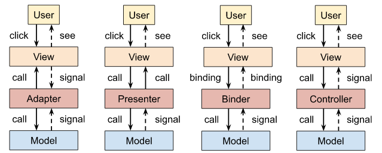
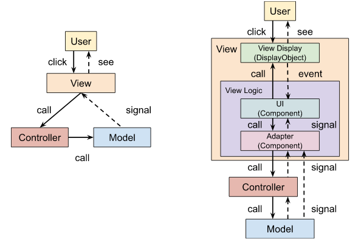

# Эволюция игрового фреймворка. Клиент 17. MVC

## MVA

Оглянемся назад и посмотрим, к чему мы пока пришли. Первым шагом на пути построения игры, было создание графики в Adobe Animate (.fla) и добавление ее в приложение с помощью библиотеки OpenFL. Это чистое отображение, или View — все, что наследуется от DisplayObject.

 Потом мы создали кое-какую логику (Dresser), чтобы оживить графику и добавить в нее интерактивность. Сделали мы это посредством классов-оберток (Component) вокруг объектов отображения (DisplayObject). Это логика, или Logic — пока что наследуется только от Component.

Затем мы выделили из логики данные и методы по управлению данными. Это модель, или Model.

В результате компоненты приобрели двойное назначение. С одной стороны они добавляют стандартную функциональность к объектам отображения, которые являются для компонентов пассивным материалом. Так мы получаем такие компоненты как Button, RadioButton, Label, являющиеся наглядными примерами воплощения шаблона проектирования декоратор ([Decorator pattern](https://en.wikipedia.org/wiki/Decorator_pattern)). Они реализуют стандартные UI-функции и являются простыми кирпичиками, из которых строится приложение. Так как они стандартные и — касательно своей применимости — универсальные, то они не могут быть привязаны к какой либо модели. Это логика отображения, или View Logic.

Но концепцию компонентов можно применять и по другому назначению. А именно для связи модели и логики отображения (View Logic). В этих компонентах мы уже не обращаемся непосредственно к скину, но только через другие, внутренние компоненты. Мы слушаем сигналы от этих компонентов и, таким образом, узнаем о действиях пользователей. В соответствии с этими сигналами мы меняем модель, что возбуждает уже сигналы модели, которые слушают другие компоненты. Так происходит обновление отображения. Так связывается View Logic и Model: в модель изменения попадают через прямой вызов методов, а в отображение — через сигналы. Такие компоненты в теории называются связывающими контроллерами (Mediating Controller).

"Связывающий" (mediating) — потому что соединяет View Logic и Model, находится между ними (от лат. medius средний). А раз он имеет равный доступ и к View Logic, и к Model, то это идеальное место для того, чтобы управлять (control) обоими и содержать бизнес-логику — поэтому контроллер (controller). Также, имея в виду промежуточное его положение, можно рассматривать данное звено как адаптер (adapter) для согласования двух разных интерфейсов — отображения и модели. А вся схема, соответственно, будет называться MVA ([Model-view-adapter](https://en.wikipedia.org/wiki/Model%E2%80%93view%E2%80%93adapter)), или [mediating-controller MVC](https://en.wikipedia.org/wiki/Model%E2%80%93view%E2%80%93adapter).

Схема MVA разрывает связь UI-компонентов с моделью, чтобы они могли развиваться независимо друг от друга. Если изменяется UI-компонент, это никак не должно затрагивать модели — нужно изменить только адаптер. То же самое, если изменяется модель. В результате UI-компоненты и модели можно выносить в библиотеки, и можно быть спокойными, что код в этих библиотеках будет стабильным, сколько бы мы проектов с их участием ни выпустили.

Отсюда, второе преимущество MVA — для одного и того же набора UI-компонентов и моделей может быть сколько угодно разных адаптеров-прослоек.

Кажется, что если View Logic и Adapter (Mediating Controller) наследуются от Component, то и отличить их без тщательного анализа их кода невозможно. Но это не так. Обычно эти два вида компонентов размещают в разных пакетах, а иногда даже и в разных библиотеках. Стандартных компонентов-кирпичиков (View Logic) больше всего в UI библиотеке ядра, так как они годятся для любого типа приложения. А компоненты-контроллеры — в более специализированных библиотеках (панели, диалоги, скрины и т.д.).

## Другие вариации MVC

MVA не единственный способ организовать код приложения. Например, если мы уберем из адаптера сигналы, а разрешим отображению напрямую вызывать его методы, то получим паттерн MVP (Model-View-Presenter), в котором наш адаптер превращается в представитель (Presenter). Чтобы можно было использовать разные версии представителя, создается общий для них всех интерфейс. Отображение знает о представителе только то, что предоставляет интерфейс — не больше.

Тут View и Model полностью независимы друг от друга — точно так же, как и в MVA и во всех прочих схемах. Обособление представление и модели — общее для всех подобных паттернов. Разница лишь в том, как это сделать

MVP шаг назад по сравнению с MVA, потому что в нем вместо сигналов (или событий) используется прямая ссылка на промежуточный слой. В результате связь между ними становится двунаправленной, что нехорошо. Но зато MVP реализовать проще, и код в нем более очевидный.

Название "представитель" (Presenter) взялось от того, что данная прослойка использовалась главным образом, чтобы брать данные из модели и форматировать их для отображения. Со временем придумали, как этот процесс упростить и сделать более удобным и для программистов, и для дизайнеров. Представитель стали заменять кодом, написанном на специальном XML-подобном языке разметки (JSX для React, MXML для Flex, XAML для .NET и т.д.). Написанный на таком языке код говорит, какую структуру отображения нужно построить и как оно должно быть связано с данными из модели. Механизм связывания данных ([data binding](https://en.wikipedia.org/wiki/Data_binding)) называется Binder. Отсюда и название паттерна — MVB (Model-View-Binder). Но чаще он называется MVVM (Model-View-ViewModel), так как промежуточный слой выполняет функции модели представления (View Model), а Binder — лишь один из механизмов ее реализации.

Но можно абстрагироваться от разных частностей и особенностей применения и сделать самую общую и универсальную схему. Оставить отображение и модель на своих местах, а связующее звено между ними назвать просто контроллером. Тогда жизненный цикл приложения будет такой: по событию от пользователя отображение вызывает определенный метод контроллера ([бизнес-логика](https://en.wikipedia.org/wiki/Business_logic)); каждый метод соответствует той или иной сложной команде, которая манипулирует одной или несколькими моделями; модель изменяется, что провоцирует возникновение события (в нашем случае — сигнала); отображение по сигналу обновляет себя новыми данными из модели.

У нас контроллеры появятся позже, поэтому этот момент пока опустим. Что касается отображения, то тут простые UI-компоненты и компоненты-контроллеры (Mediating Controller, или Adapter в MVA) объединяются в просто View Logic, оставляя понятие контроллера только для одной бизнес-логики.

Так как MVC — самое общее решение, то все остальные — и MVA, и MVP, и MVVM — обычно принимаются как его частные случаи или вариации.

Небольшая группа моделей, компонентов отображения и контроллеров может образовывать законченное целое, некий обособленный модуль. Можно даже строить целое приложение как иерархию таких модулей. Такой паттерн называется [HMVC](https://en.wikipedia.org/wiki/Hierarchical_model%E2%80%93view%E2%80%93controller) (Hierarchical model–view–controller).

Классы, объединенные одним назначением, образуют слои (tiers, layers). В приложениях, построенных по MVC-шаблону мы априори имеем три таких слоя: слой данных (Data tier), отображения (Presentation tier) и логики (Logic tier). Первый занимается хранением и обработкой данных, второй — пользовательским интерфейсом, последний — бизнес-логикой и различными правилами.

Приложение, разделенное на слои, легче поддерживать, изменять, так как каждый слой относительно независим от других, и потому ими можно заниматься отдельно, не рискуя внести ошибки в другие. Слои взаимодействуют друг с другом через интерфейсы, и покуда интерфейсы неизменны, то и изменения в одном слое не будут влиять на другие.

В офлайн-версии приложения так или иначе присутствуют все перечисленные слои. Но в клиент-серверных программах модель и контроллер полностью (для тонкого клиента) или частично (для толстого клиента) переносятся на сервер. Что неизменно присутствует в клиенте, так это отображение. В следующем разделе мы как раз и приступим к рассмотрению разработки сетевых игр, на примере которых увидим, почему нам не обойтись без контроллеров, и зачем они вообще нужны.

[Исходники](https://gitlab.com/markelov-alex/hx-py-framework-evolution/-/tree/main/f_models/client_haxe/src/)

[< Назад](01_client_16.md)  |  [Начало](00_intro_01.md)  |  [Вперед >](01_client_18.md)
