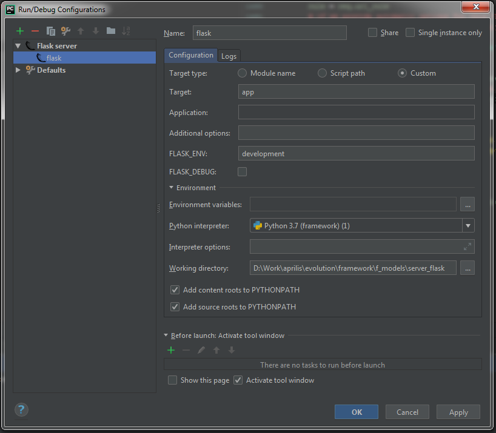

# Эволюция игрового фреймворка. Клиент 18. HTTP-клиент

С развитием интернета и проникновением его в каждый дом традиционные офлайн игры уступают место клиент-серверным. И это не удивительно, ведь теперь можно играть не только с самим собой, но и со всем миром. А с помощью социальных сетей можно быстро подключить к игре своих друзей, обмениваться с ними редкими артефактами и делиться своими успехами.

Сейчас используется два основных типа серверов: HTTP- и сокет-серверы. HTTP-сервер используется в простых приложениях, в особенности с одиночным геймплеем. Схема его работы проста: клиент делает запрос (шлет данные в виде текстовой строки, например, в формате JSON или XML), а сервер генерирует на этот запрос ответ (шлет другие данные в том же формате). Главный его недостаток, что сервер не может сам послать запрос клиенту. Он может только отвечать.

Этот недостаток устраняется использованием сокетов. Сокеты позволяют отправить любое двоичное (в том числе и текстовое) сообщение в любой момент и в любую сторону — хоть на сервер, хоть на клиент. Это позволяет реализовывать сетевой режим даже в играх реального времени, где нужно быстро обмениваться сообщениями между сервером и его клиентами.

Мы рассмотрим обе реализации клиента. Но так как HTTP проще и используется чаще, начнем с него. Но прежде, чем приступить к клиенту, разберемся сначала с сервером и непосредственно самим протоколом.

## HTTP

HTTP — это протокол прикладного уровня, разработанный для передачи гипертекстовых документов в формате HTML. Поэтому он так и называется — протокол передачи гипертекста (HyperText Transfer Protocol). Со временем его стали использовать для передачи произвольных данных.

Но самое интересное, что для своей работы он использует сокеты. Но не так, как мы их будем использовать в наших играх — установили соединение и давай обмениваться сообщениями туда-сюда. Нет, в HTTP соединение разрывается сразу же после отправки данных. Именно обрыв соединения говорит и клиенту, и серверу, что данные переданы все и можно начинать обработку.

Когда мы будем использовать сокеты напрямую, нам придется придумать свой собственный протокол прикладного уровня. Но пока разберемся в устройстве HTTP. Ведь благодаря взрывной популярности гипертекста (HTML) и браузеров, его распростаненность стала поистине всепротикающей.

Как уже было сказано, и запрос и ответ — это текст. Текстовые данные определенного формата. Формат запроса и ответа — это как раз и есть протокол. Согласно HTTP все сообщение разбивается на строки привычным символом переноса строки \n (клавиша Enter).

Первая строка запроса должна иметь следующий вид: Метод URI HTTP/Версия, например, "GET /wiki/HTTP HTTP/1.0". Следом идут строки-заголовки с служебными данными вроде того, с какого клиента было послано сообщение ("User-Agent: Mozilla/5.0 (X11; U; Linux i686; ru; rv:1.9b5) Gecko/2008050509 Firefox/3.0b5"), название сайта ("Host: ru.wikipedia.org") и т.д. Когда встречается пустая строка, это значит, что заголовки закончились и дальше пойдет тело сообщения, т.е. собственно данные, которые мы хотим передать.

Ответное сообщение похоже на запрос тем, что заголовки отделяются от тела пустой строкой. Но сами заголовки отличаются. Они теперь говорят не о клиенте, а сервере и о том насколько успешно был обработан запрос. Именно об этом и сообщает самая первая строка. Она имеет следующий формат: HTTP/Версия КодСостояния Пояснение. Пример: "HTTP/1.0 200 OK". После стартовой строки идут традиционно заголовки (одна строка — один заголовок), потом пустая строка и тело сообщения. Заголовки бывают чисто клиентские (Request Headers), чисто серверные (Response Headers) и общие для тех и других (General Headers и Entity Headers).

Все это мы могли бы реализовать и сами на сокетах, но, по счастью, существует немало готовых библиотек и даже своеобразных языков программирования (PHP), которые уже сделали это за нас. Они предоставляют удобный API, так что мы можем целиком сосредоточится на решении нашей конкретной задачи и не думать о разных там протоколах.

## Server

Для написания нашего сервера выберем одно из самых популярных и удобных сочетаний: язык Python3 + библиотека Flask. Вся логика сервера поместится всего в одном скрипте, так как нам нужно будет реализовать простой сервис-хранилище (storage) с операциями set, get, update. Операции вполне стандартные: загрузить все состояние на сервер, получить все состояние и частично изменить состояние. (Удалять нам сейчас нет нужды.) Данные хранятся в файле. Так как в качестве ключа (key) клиентом будет использоваться имя игры, то получается, что одна игра — один файл.

```python
import json
import os

from flask import Flask, send_file, request
from markupsafe import escape

app = Flask(__name__)


@app.route("/storage/<key>", methods=["GET", "POST"])
def storage(key):
    key = escape(key)
    filename = "../data/save_" + key
    values = request.values
    method = values.get("_method") or request.method
    if method == "POST":
        # Save
        data_str = values.get("data")
        if data_str:
            if not os.path.exists("saves/"):
                os.mkdir("saves")
            with open(filename, "w") as f:
                data = json.loads(data_str)
                json.dump(data.get("state"), f)
                # f.write(data_str)
                print("save", data.get("state"))
                return json.dumps({"success": True})
        return json.dumps({"success": False})
    elif method == "GET":
        # Load
        if not os.path.exists(filename):
            return json.dumps({"success": False})
        with open(filename, "r") as f:
            state = json.load(f)
            print("load", state)
            return {"success": True, "state": state}
    elif method == "PATCH":
        # Update
        data_str = values.get("data")
        data = json.loads(data_str) if data_str else None
        if not data or not os.path.exists(filename):
            return json.dumps({"success": False})
        with open(filename, "r") as f:
            state = json.load(f)
            # (id is a pictureIndex in Coloring game)
            id = data.get("id")  # For 2-dimensional data array (not used)
            index = data.get("index")
            value = data.get("value")
            d = state[id] if isinstance(id, int) else state
            if not isinstance(index, int) or not isinstance(value, int) \
                    or not isinstance(d, (list, dict)):
                return json.dumps({"success": False})
            d[index] = value
            with open(filename, "w") as f2:
                json.dump(state, f2)
                print("update", state)
            return {"success": True, **data}
    return None


@app.route("/crossdomain.xml")
def crossdomain():
    return send_file("crossdomain.xml")
```

Также мы должны отдавать crossdomain.xml по запросу к адресу "/crossdomain.xml", чтобы мы могли тестировать клиент на Flash Player. Все приложения на Haxe сначала отлаживаются под Flash и только потом мы можем экспортировать их на другие платформы.

Вот полный текст скрипта. Как видно, в нем не сложно разобраться и самому, если знаешь Python. А если не знаешь, то можно пока не заморачиваться, а просто научиться его запускать. Для клиентщиков большего и не надо.

Для того, чтобы скрипт заработал, нужно сначала создать и активировать виртуальное окружение, воплив следующие команды в той же папке, что и наша программа:

```shell script
# Create virtual environment
py -3 -m venv venv
# Activate virtual environment
venv\Scripts\activate
```

Потом в это окружение устанавливаем библиотеку Flask:

```shell script
# Install dependencies
pip install flask
```

Из окружения с установленным Flask, можно уже запускать сам сервер:

```shell script
# Set up flask server
FLASK_APP=app
FLASK_ENV=development
# Run flask server
flask run
```

Для установки и запуска есть два скрипта. Чтобы его можно было отлаживать, нужно создать и настроить [Flask](https://flask.palletsprojects.com/en/2.1.x/installation/)-проект в PyCharm или другой IDE:



## Requests

OpenFL предоставляет знакомые всем Flash-разработчикам средства отправки HTTP-запросов — класс URLLoader. Мы создаем экземпляр этого класса, подписываемся на события Event.COMPLETE, IOErrorEvent.IO_ERROR, SecurityErrorEvent.SECURITY_ERROR и вызываем метод load(). В load() нам нужно передать объект запроса — класс URLRequest, в котором указываются URL сервера и разные переменные-данные (класс URLVariables).

Лучшее место, откуда можно делать запросы — это выделенная ранее  в отдельный класс модель:

```haxe
class DresserModel
{
    // Settings
    public var url = "http://127.0.0.1:5000/storage/dresser";
    // State
    private var _state:Array<Int> = [];
    @:isVar
    public var state(get, set):Array<Int>;
    public function get_state():Array<Int>
    {
        return _state;
    }
    public function set_state(value:Array<Int>):Array<Int>
    {
        if (value == null)
        {
            value = [];
        }
        if (!ArrayUtil.equal(_state, value))
        {
            send({state: value}, function (data:Dynamic):Void {
                if (data.success)
                {
                    _state = data.state;
                    stateChangeSignal.dispatch(data.state);
                }
            }, URLRequestMethod.POST);
        }
        return value;
    }
    public var stateChangeSignal(default, null) = new Signal<Array<Int>>();
    public var itemChangeSignal(default, null) = new Signal2<Int, Int>();

    public function load():Void
    {
        send(null, function (data:Dynamic):Void {
            if (data.success)
            {
                _state = data.state;
                stateChangeSignal.dispatch(data.state);
            }
        });
    }
    public function changeItem(index:Int, value:Int):Void
    {
        if (state[index] != value)
        {
            send({index: index, value: value}, function (data:Dynamic):Void {
                if (data.success)
                {
                    state[data.index] = data.value;
                    itemChangeSignal.dispatch(data.index, data.value);
                }
            }, "PATCH");
        }
    }
    private function send(?data:Dynamic, ?callback:Dynamic->Void,
                          method:String=URLRequestMethod.GET):Void
    {
        var request = new URLRequest(url);
        //request.method = method; // Doesn't work for anything except GET and POST
        // Also doesn't work
        request.requestHeaders.push(new URLRequestHeader("X-METHOD-OVERRIDE", method));
        request.data = new URLVariables();
        request.data._method = method;
        request.data.antiCache = Timer.stamp();
        request.data.data = Json.stringify(data);
        var loader = new URLLoader();
        var loader_ioErrorHandler;
        var loader_securityErrorHandler;
        function loader_completeHandler(event:Event):Void
        {
            Log.debug('Request complete ${loader.data}');
            loader.removeEventListener(Event.COMPLETE, loader_completeHandler);
            loader.removeEventListener(IOErrorEvent.IO_ERROR, loader_ioErrorHandler);
            loader.removeEventListener(SecurityErrorEvent.SECURITY_ERROR, loader_securityErrorHandler);
            var data = parseResponse(event);
            if (callback != null)
            {
                callback(data);
            }
        }
        loader_ioErrorHandler = function (event:IOErrorEvent):Void
        {
            Log.error('Request fail $event');
            loader.removeEventListener(Event.COMPLETE, loader_completeHandler);
            loader.removeEventListener(IOErrorEvent.IO_ERROR, loader_ioErrorHandler);
            loader.removeEventListener(SecurityErrorEvent.SECURITY_ERROR, loader_securityErrorHandler);
        }
        loader_securityErrorHandler = function (event:SecurityErrorEvent):Void
        {
            Log.error('Request fail (security) $event.');
            loader.removeEventListener(Event.COMPLETE, loader_completeHandler);
            loader.removeEventListener(IOErrorEvent.IO_ERROR, loader_ioErrorHandler);
            loader.removeEventListener(SecurityErrorEvent.SECURITY_ERROR, loader_securityErrorHandler);
        }
        loader.addEventListener(Event.COMPLETE, loader_completeHandler);
        loader.addEventListener(IOErrorEvent.IO_ERROR, loader_ioErrorHandler);
        loader.addEventListener(SecurityErrorEvent.SECURITY_ERROR, loader_securityErrorHandler);
        loader.load(request);
    }
    private function parseResponse(event:Event):Dynamic
    {
        var loader:URLLoader = cast(event.currentTarget, URLLoader);
        Log.debug('Parse data: ${loader.data} from url: $url');
        try
        {
            var data:Dynamic = Json.parse(loader.data);
            Log.debug(' Parsed state data: $data from url: $url');
            return data;
        }
        catch (e:Exception)
        {
            Log.error('Parsing error: $e');
        }
        return null;
    }
}
class Dresser extends Component
{
    //...
    override private function assignSkin():Void
    {
        super.assignSkin();
        // Get initial state
        model.load();
    }
    //...
}
```

Теперь видите, почему полезно отделять модель от отображения? Можно подменить реализацию DresserModel, и вот игра уже работает в режиме онлайн. При этом мы по-прежнему можем использовать и офлайн версию, когда захотим. Отображение остается точно таким же.

За исключением новой строчки ```model.load();```, которая появилась в связи с изменением интерфейса модели. Для офлайн версии DresserModel load() будет просто пустым методом.

Чтобы избавится от анонимных функций (они же замыкания, closures), нужно сохранять ```callback``` в свойствах объекта. Так как у нас одновременно допускается несколько запросов, то объект DresserModel не подходит, потому что значение ```callback``` будет перезаписываться, а нам нужен отдельный ```callback``` для каждого запроса. Значит, нужно для каждого запроса создавать отдельный объект. Создадим для этих целей класс Request:

```haxe
class DresserModel
{
    // Settings
    public var url = "http://127.0.0.1:5000/storage/dresser";
    // State
    public var state(default, set):Array<Int> = [];
    public function set_state(value:Array<Int>):Array<Int>
    {
        if (value == null)
        {
            value = [];
        }
        if (!ArrayUtil.equal(state, value))
        {
            new Request().send(url, value, function (response:Dynamic):Void {
                var data = parseResponse(response);
                if (data.success)
                {
                    _state = data.state;
                    stateChangeSignal.dispatch(data.state);
                }
            });
        }
        return value;
    }
    public var stateChangeSignal(default, null) = new Signal<Array<Int>>();
    public var itemChangeSignal(default, null) = new Signal2<Int, Int>();

    public function new()
    {
    }
    public function load():Void
    {
        new Request().send(url, null, function (response:Dynamic):Void {
            var data = parseResponse(response);
            if (data.success)
            {
                _state = data.state;
                stateChangeSignal.dispatch(data.state);
            }
        });
    }
    public function changeItem(index:Int, value:Int):Void
    {
        if (state[index] != value)
        {
            new Request().send(url, {index: index, value: value}, function (response:Dynamic):Void {
                var data = parseResponse(response);
                if (data.success)
                {
                    state[data.index] = data.value;
                    itemChangeSignal.dispatch(index, value);
                }
            }, "PATCH");
        }
    }
	private function parseResponse(response:Dynamic):Dynamic
	{
		Log.debug('Load data: ${response} from url: $url');
		try
		{
			var data:Dynamic = Json.parse(response);
			Log.debug(' Loaded state data: ${data} from url: $url');
			return data;
		}
		catch (e:Exception)
		{
			Log.error('Parsing error: $e');
		}
		return null;
	}
}
class Request
{
    // Settings
    private var url:String;
    private var callback:Dynamic->Void;
    // State
    private var loader:URLLoader;

    public function new()
    {
    }
    public function send(url:String, ?data:Dynamic, ?callback:Dynamic->Void,
                         method:String=URLRequestMethod.GET):Void
    {
        // Stop current if any
        dispose();
        this.url = url;
        this.callback = callback;
        var request = new URLRequest(url);
        //request.method = method; // Doesn't work for anything except GET and POST
        request.data = new URLVariables();
        request.data._method = method; // Workaround
        request.data.antiCache = Timer.stamp();
        request.data.data = Json.stringify(data);
        loader = new URLLoader();
        loader.addEventListener(Event.COMPLETE, loader_completeHandler);
        loader.addEventListener(IOErrorEvent.IO_ERROR, loader_ioErrorHandler);
        loader.addEventListener(SecurityErrorEvent.SECURITY_ERROR, loader_securityErrorHandler);
        loader.load(request);
    }
    public function dispose():Void
    {
        url = null;
        callback = null;
        if (loader != null)
        {
            try
            {
                loader.close();
            }
            catch (e:Exception)
            {}
            loader.removeEventListener(Event.COMPLETE, loader_completeHandler);
            loader.removeEventListener(IOErrorEvent.IO_ERROR, loader_ioErrorHandler);
            loader.removeEventListener(SecurityErrorEvent.SECURITY_ERROR, loader_securityErrorHandler);
            loader = null;
        }
    }
    private function loader_completeHandler(event:Event):Void
    {
        if (callback != null)
        {
            var loader:URLLoader = cast(event.currentTarget, URLLoader);
            callback(loader.data);
        }
        dispose();
    }
    private function loader_ioErrorHandler(event:IOErrorEvent):Void
    {
        Log.error('Request fail $event');
        dispose();
    }
    private function loader_securityErrorHandler(event:SecurityErrorEvent):Void
    {
        Log.error('Request fail (security) $event.');
        dispose();
    }
}
```

Создание класса Request сделало нашу модель значительно чище и понятнее. Flash/OpenFL API не очень-то удобно в плане отправления запросов на сервер со всеми его URLLoader, URLRequest, URLVariables. Мы же скрыли все эти детали в единственном методе send(). В следующем материале мы покажем, как абстрагироваться еще и от класса Request. Для этого мы введем концепцию сервисов.

[Исходники](https://gitlab.com/markelov-alex/hx-py-framework-evolution/-/tree/main/f_models/)

[< Назад](01_client_17.md)  |  [Начало](00_intro_01.md)  |  [Вперед >](01_client_19.md)
