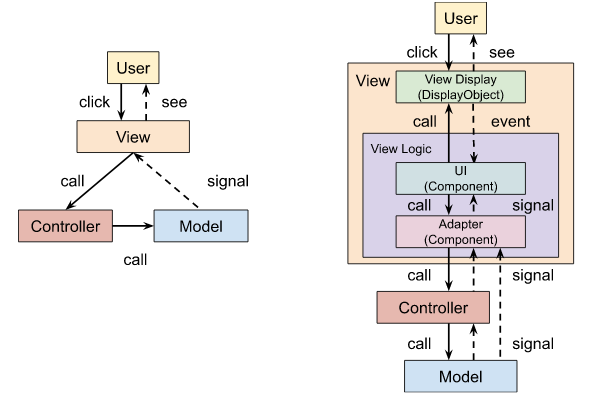

# Эволюция игрового фреймворка. Клиент 20. Контроллер

Не так давно, изучая разные [схемы](01_client_17.md) реализации паттерна MVC мы также бегло рассмотрели схему классического MVC с контроллерами:



Теперь настало время ее реализовать. К сожалению наш пример слишком простой, чтобы в такой схеме действительно появилась насущная необходимость. Поэтому код ниже покажется вам несколько надуманным. Но пусть эта же простота послужит на пользу и сделает общую идею более понятной.

А идея заключается в том, что хранение и непосредственная обработка данных осуществляется в модели, а бизнес-логика и прочие правила реализуется в контроллере. Контроллер не работает с данными напрямую, а лишь вызывает методы моделей. Если логика простая, а модель одна, то контроллер будет в основном лишь перенаправлять все запросы в модель, а больше делать ничего не будет. Такой контроллер можно вовсе убрать, а использовать вместо него напрямую модель. Но если моделей несколько и их работу надо координировать, то тут контроллер будет в самую пору.

Наш пример из разряда очень простых, а потому не очень показательный. Но представьте, что вот-вот тут добавиться какая-нибудь другая модель, для которой нужно обеспечить взаимодействие с DresserModel. Тогда вынесение DresserController из DresserModel будет иметь смысл:

```haxe
class DresserController
{
    // State
    public var model(default, null):DresserModel;

    public function new()
    {
        model = new DresserModel();
    }
    public function load():Void
    {
        model.load();
    }
    public function setState(value:Array<Int>):Void
    {
        model.setState(value);
    }
    public function changeItem(index:Int, value:Int):Void
    {
        model.changeItem(index, value);
    }
}
class Dresser extends Component
{
    // Settings
    public var itemPathPrefix = "item";
    public var prevButtonPathPrefix = "prevButton";
    public var nextButtonPathPrefix = "nextButton";
    // State
    private var screens:Screens;
    private var controller:DresserController;
    private var model:DresserModel;
    private var closeButton:Button;
    private var items:Array<MovieClip>;
    private var prevButtons:Array<Button>;
    private var nextButtons:Array<Button>;

    override private function init():Void
    {
        super.init();
        screens = ioc.getSingleton(Screens);
        controller = ioc.create(DresserController);
        model = controller.model;
        model.stateChangeSignal.add(model_stateChangeSignalHandler);
        model.itemChangeSignal.add(model_itemChangeSignalHandler);
        closeButton = createComponent(Button);
        closeButton.skinPath = "closeButton";
        closeButton.clickSignal.add(closeButton_clickSignalHandler);
        addChild(closeButton);
    }
    override public function dispose():Void
    {
        super.dispose();
        if (model != null)
        {
            model.stateChangeSignal.remove(model_stateChangeSignalHandler);
            model.itemChangeSignal.remove(model_itemChangeSignalHandler);
            model = null;
        }
		controller = null;
        screens = null;
    }
    override private function assignSkin():Void
    {
        super.assignSkin();
        //...
        // Apply
        controller.load();
    }
    override private function unassignSkin():Void
    {
        items = null;
        prevButtons = null;
        nextButtons = null;
        super.unassignSkin();
    }
    private function switchItem(index:Int, step:Int=1):Void
    {
        var item = items[index];
        if (item != null)
        {
            var value = model.state[index];
            var maxValue = item.totalFrames;
            value = ((value != null ? value : 1) + step) % maxValue;
            value = value < 1 ? maxValue - value : value;
            controller.changeItem(index, value);
        }
    }
    private function closeButton_clickHandler(target:Button):Void
    {
        screens.open(Menu2);
    }
    private function prevButton_clickSignalHandler(target:Button):Void
    {
        var index = prevButtons.indexOf(target);
        switchItem(index, -1);
    }
    private function nextButton_clickSignalHandler(target:Button):Void
    {
        var index = nextButtons.indexOf(target);
        switchItem(index, 1);
    }
    private function model_stateChangeSignalHandler(value:Array<Int>):Void
    {
        for (i => v in value)
        {
            var item = items[i];
            if (item != null)
            {
                item.gotoAndStop(v);
            }
        }
    }
    private function model_itemChangeSignalHandler(index:Int, value:Int):Void
    {
        var item = items[index];
        if (item != null)
        {
            item.gotoAndStop(value);
        }
    }
}
```

Вот, как это работает. В компонентах на действия пользователя вызывается метод контроллера; контроллер изменяет состояние модели; модель оповещает об изменениях через сигналы; компоненты слушают сигналы модели, берут из нее обновленные данные и отображают их на экране.

Каждый метод контроллера — это команда бизнес-логики. Команды эти выполняются, тем или иным образом оперируя с моделями. Если нужно изменить правило бизнес-логики или способ выполнения команды, можно реализовать другой контроллер. Операции по обработке данных, а значит, и сами модели при этом могут не меняться.

Также можно вынести сервис из модели в контроллер. Тогда контроллер будет обеспечивать взаимодействие сервиса с моделью. Сервис будет добывать данные из сервера или файла, а модель — их обрабатывать и хранить.

Когда мы будем рассматривать тонкий клиент, нам вообще будет не обязательно хранить состояние, потому что мы всегда можем сделать запрос на сервер и сразу отобразить полученные данные на экране. У нас не будет на клиенте никакой другой логики, которая бы оперировала информацией. Тонкий клиент потому и называется тонким, что абсолютно вся логика вынесена на сервер. А раз нам не нужно хранить состояние, то и модели нам не нужны. Тогда останется просто контроллер с сервисом.

А раз в клиенте, как мы уже сказали, нет логики, то и контроллер не нужен. Ведь все, что он будет делать — это просто перенаправлять вызовы методов в сервис и ничего больше. Остается один сервис. Но так как компонентам не с руки обращаться напрямую к сервисам — они все же привыкли иметь дело с контроллерами и моделями, то сервис можно будет переименовать в контроллер. Все же интерфейс у них будет одинаковым, разница лишь в реализации. Поэтому в случае тонкого клиента контроллер сливается с сервисом в одно целое: название у него и интерфейс как у контроллера, а имплементация — сервисная. При этом всегда можно реализовать офлайн контроллер — т.е. с нормальной логикой, без сервера — и подставить его в компоненты. Т.к. интерфейс один и тот же, они не заменят подмены.

Но подробнее обо всем этом в [следующий раз](01_client_21.md).

[Исходники](https://gitlab.com/markelov-alex/hx-py-framework-evolution/-/tree/main/g_sockets/client_haxe/src/v7/)

[< Назад](01_client_0.md)  |  [Начало](00_intro_01.md)  |  [Вперед >](01_client_0.md)
