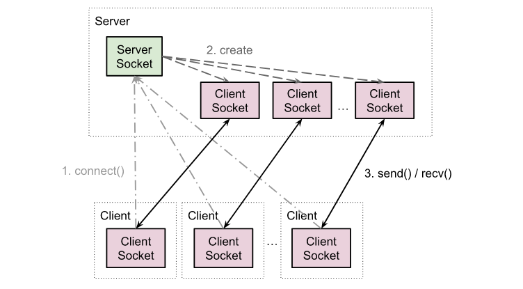

# Эволюция игрового фреймворка. Сервер 4. Сокеты

Чтобы лучше понять, как устроены и работают сокеты, обратимся сначала к самым основам. В данном случае — к понятию программы.

Программа — это определенная последовательность инструкций и данных, которая хранится в памяти. Когда программа передается на исполнение, она превращается в процесс. На аппаратном уровне он выполняется процессором. На программном процессы управляются операционной системой (ОС), которая сама, в свою очередь, также является процессом.

Программы, предназначенные для выполнения прикладных пользовательских задач, называются приложениями. В противоположность системным программам, которые обычно являются частью ОС. И те и другие запускаются как процессы ОС, и перечень действующих процессов всегда можно посмотреть в диспетчере задач (команда ```top``` для Linux, Ctrl+Shift+Esc для Windows).

Основное и единственное назначение программы — это вычислять и управлять. Вычислять, чтобы управлять, и управлять, чтобы вычислять. Управлять среди прочего и процессором, а именно ходом выполнения программы (if-else, for, while, etc). К другим устройствам, помимо процессора и оперативной памяти, программа обращается только через ОС. Делается это через системные вызовы — специальный программный интерфейс (API), по которому можно вызвать подпрограммы операционной системы. В практическом программировании они представлены библиотекой функций, которые снаружу не отличаются от всех прочих функций на данном языке программирования (ЯП). Через системные вызовы можно, например, прочитать или записать данные в файл, создать или убить процесс, управлять внешними устройствами, обмениваться данными между процессами. Одной из реализаций последнего пункта и посвящена данная заметка.

Существует несколько способов межпроцессного взаимодействия (Inter-process communication, IPC). Одни возникали как совершенствование более старых способов, другие строились как их замена, основанная на других принципах, более подходящих для той или области применения. И все они, как и сами процессы, реализуются через средства ОС. Например, если процессы запущены на одной машине, то лучше всего использовать pipes или shared memory (разделяемую память). Если на разных, особенно если и типы машин отличаются (т.е. для кросс-платформенного сообщения) — вне конкуренции сокеты (sockets).

Как всегда во время первоначального развития какой-либо технической отрасли, каждая компания или организация придумывает собственное решение на встающие перед ней проблемы. В результате получается целый зоопарк различных систем, протоколов и спецификаций. И все они, конечно, не совместимы друг с другом. Поэтому нужно писать отдельную реализацию программы, чтобы она могла работать с еще одной системой. Такой разброд и самодеятельность происходят до тех пор, пока не организуется комиссия по выработке единого стандарта, состоящая из представителей ведущих разработчиков в данной области. Но бывают случаи, когда одно из частных решений оказывается настолько удачным, что все остальные игроки реализуют его у себя, так что оно становится де-факто стандартом без всяких комиссий, само по себе.

Так получилось с сокетами. Придуманные в Беркли в 1982 году как часть ОС BSD Unix, они моментально разошлись по интернету как очень простой и удобный способ коммуникации между разными системами, и сейчас в том или ином виде реализованы практическими всеми ОС. Поэтому программный интерфейс (API), который мы будем тут рассматривать, и называется сокетами Беркли. Решение было настолько абстрактным и универсальным, что одинаково годилось и для локального использования, и для работы по сети.

Сокет переводится с англ. как розетка, разъем и является в данном механизме конечной точкой соединения. Одну точку можно отличить от другой по ее адресу. Адрес сокета состоит из двух частей: адрес машины (host), представленный IP-адресом, и номер порта, для различения сокетов внутри одной машины. В URL-форме, которая используется в браузерах, обе части находятся в одной строке, разделенной двоеточием. Например, в "192.168.0.11:1234" 192.168.0.11 — это IP-адрес, а 1234 — номер порта. IP-адрес может заменяться для удобства доменным именем: my.site.com:1234. В конечном итоге доменное имя всегда преобразуется в IP-адрес, т.к. сеть работает только с численными адресами. Этим преобразованием занимается специальная служба доменных имен (DNS).

Сокеты бывают двух типов: клиентские и серверные. Серверные не делают ничего, кроме приема запросов на установление соединения и создания клиентского сокета для каждого нового подключения. Клиентские сокеты не делают ничего, кроме как обмениваются данными. И на сервере, и на клиенте клиентские сокеты идентичны. Соединение между клиентскими сокетами одного ранга — peer-to-peer. Сервер отличается от клиента, главным образом, наличием одного серверного сокета. Из этого вытекает необходимость поддерживать на сервере одновременную работу нескольких клиентских сокетов, тогда как в клиентском приложении достаточно одного сокета. Поэтому даже на сервере основная работа приходится именно на клиентские сокеты, а не на серверные.



Слово сервер имеет несколько значений. Прежде всего, так мы называем программу, на которой запущены серверные сокеты. Кроме того, так называют еще и машину, на которой запущена такая программа. Аналогично и с клиентом. Этим словом называют программу, использующую только клиентские сокеты, и машину, на которой запущена данная программа. Вся эта схема, вместе взятая, образует клиент-серверную модель взаимодействия. Суть ее в том, что разные клиенты подключаются к одному серверу, который координирует и управляет их работой.

Адрес сервера обычно публичный и его знают все клиенты, а вот сервер своих клиентов заранее, как правило, не знает и знать не может. Поэтому в основном подключение инициируется клиентом. Но это всего лишь проектное решение, а не свойство самих сокетов ([источник](https://docs.python.org/3/howto/sockets.html#using-a-socket)).

## Сокеты в Python

После небольшого теоретического введения можно перейти к коду.

Во-первых, нужно создать объект сокета. Для клиента и сервера он создается одинаково:

```python
server_sock = socket.socket(socket.AF_INET, socket.SOCK_STREAM)
```

AF_INET - означает интернет сокет по протоколу IPv4 (также существуют: AF_INET6 — для IPv6, AF_IPX — для IPX, AF_UNIX — для Unix-сокетов).
SOCK_STREAM - говорит о том, что в качестве транспортного протокола будет использоваться TCP. Второй распространенный вариант — это UDP (SOCK_DGRAM). Первый используется там, где важна надежность, второй — где скорость. TCP гарантирует доставку всех сообщений, причем в том же порядке, в котором они были переданы. UDP возвращает сообщения сразу по прибытии — без проверки, обработки и подтверждений приема. Поэтому он гораздо быстрее TCP.

Далее начинаются различия между серверным и клиентским сокетами. Серверный сокет привязывается к адресу (bind) и начинает слушать по нему подключения (listen). После этого каждый вызов функции accept() будет создавать новый клиентский сокет, как только появится подключение:

```python
server_sock.bind((HOST, PORT))
server_sock.listen(5)
conn, addr = server_sock.accept()
```

HOST — это IP адрес системы, где запущен сервер. Если сокет должен быть виден только снаружи, из других систем, то нужно взять значение из server_sock.gethostname(). Если он должен быть виден только изнутри, то необходимо задать "localhost" или "127.0.0.1". Значение "" осуществляет привязку ко всем доступным для данной машины адресам: и локальным, и глобальным. Заметим, что использование "localhost" для локального доступа позволяет пропустить несколько слоев сетевого кода, что быстрее, чем использовать HOST="".
PORT — порт сервера. Так как малые значения большей частью зарезервированы, то рекомендуется использовать любое 4-значное число.
5 — количество одновременно ожидающих обработки подключений. Все остальные будут отбрасываться. Для правильно построенного приложения величины 5 более чем достаточно.

Для того, чтобы принимать неограниченное число соединений, поместим accept() в бесконечный цикл:

```python
server_sock.bind((HOST, PORT))
server_sock.listen(5)
while True:
	sock, addr = server_sock.accept()
	# ...
```

Дальше мы используем полученный клиентский сокет sock точно так же, как и на клиенте (о чем ниже).

На клиенте все значительно проще. Мы просто сразу подключаемся по заданному адресу вызовом метода connect():

```python
sock.connect((HOST, PORT))
```

После этого сокет готов к отправке (sock.send()) и получению (sock.recv()) данных. При вызове send() переданная в аргументе последовательность байтов добавляется в буфер отправки для соответствующего соединения. Когда именно буфер будет отправлен, зависит от операционной системы и уровня ее загруженности.

Аналогично, существует буфер приема данных, который пополняется с каждым новым полученным по сети пакетом. В методе recv() мы передаем максимальное число байтов, которое мы желаем получить. Если в буфере меньше данных, чем мы запрашиваем, то функция возвращает, сколько есть.

Общая схема работы приложения на сокетах проста: событие -> send message -> receive response -> событие. Пользователь или программа создают какое-то событие, на него генерируется соответствующее сообщение, оно отсылается (от клиента серверу или от сервера клиенту), а потом получается ответ. Принятое сообщение также можно воспринять как событие, в результате чего процесс повторяется.

Вот пример упрощенного клиента, который отправляет введенную строку после каждого нажатия клавиши Enter. Чтобы не ограничивать себя вводом только одной строки, мы обернули код в бесконечный цикл:

```python
# Client
while True:
	data = input("Type the message to send:")
	data_bytes = data.encode()  # str to bytes
	sock.sendall(data_bytes)
	data_bytes = sock.recv(1024)
	data = data_bytes.decode()  # bytes to str
	print("Received:", data)
```

На сервере процесс аналогичный: сообщение получается, обрабатывается, и отправляется назад ответ:

```python
# Server
while True:
	data = sock.recv(1024)
	data = data.upper()  # Process
	sock.sendall(data)
```

В данных примерах клиент только отсылает сообщения и никак их не обрабатывает, лишь отображает. А сервер только обрабатывает полученные сообщения и не генерирует новые. Но в реальных приложениях обычно обе стороны обрабатывают полученные сообщения, и обе генерируют новые.

Однако, часто именно клиент инициирует больше всего сообщений, так как он управляется пользователем — основным источником событий. В то же время сервер будет являться основным обработчиком событий, т.к. именно на сервере реализована большая часть логики всего приложения. Это делается для того, чтобы, будучи изолированной от пользователей, ее никто не смог взломать и подкрутить в свою пользу. Поэтому можно сказать, что клиент работает по циклу send-receive-send, а сервер — по receive-send-receive. В действительности же это один и тот же цикл send-receive, но в разных начальных фазах. Другими словами, жизненный цикл клиента и сервера одинаковый.

Полный же жизненный цикл сокета завершается с закрытием соединения. Закрывать соединение необходимо всегда явным образом — вызовом метода close(). Даже не смотря на то, что close() вызывается автоматически при сборе мусора (периодической очистки памяти от ранее удаленных переменных). Если, например, убить клиентский процесс без вызова close(), то на сервере об этом не узнают и так и будут ждать от него сообщений хоть целую вечность.

Метод close() высвобождает ресурсы, выделенные сокету, но еще не гарантирует немедленного закрытия соединения. Если момент закрытия важен, то нужно явно вызывать метод shutdown(how) с одним из значений SHUT_RD=0, SHUT_WR=1, SHUT_RDWR=2. Так, например, при отсылке HTTP-запроса клиент вызовом shutdown(SHUT_WR) говорит серверу, что передача закончилась и больше данных не будет — можно начинать обработку запроса. При этом тот же сокет все еще может получать данные с сервера и ждет ответ. На сервере recv() при этом возвращает b"" — значение длиной в 0 байтов, что означает состояние End of File (EOF).

Чтобы не вызывать каждый раз close(), весь блок кода, работающего с сокетами, можно также обернуть в конструкцию with:

```python
# Client
with socket.socket(socket.AF_INET, socket.SOCK_STREAM) as sock:
	sock.connect((HOST, PORT))
	while True:
		data = input("Type the message to send:")
		data_bytes = data.encode()  # str to bytes
		sock.sendall(data_bytes)
		data_bytes = sock.recv(1024)
		data = data_bytes.decode()  # bytes to str
		print("Received:", data)
```

Класс socket относится к менеджерам контекста (context manager). Это значит, что у него есть два магических метода: __enter__() и __exit__(). Первый вызывается перед началом выполнения блока with, последний — после окончания его выполнения. В методе __exit__() происходит закрытие сокета:

```python
class socket(_socket.socket):
    def __enter__(self):
        return self

    def __exit__(self, *args):
        if not self._closed:
            self.close()
    # ...
```

Итак, обобщая, всю работу сокетов можно свести к двум парам методов: accept/connect-close и send-recv. Первая отвечает за соединения, вторая — за пересылку данных. Далее мы рассмотрим подробнее, как сокеты применяются на практике. Вы имеете возможность проследить всю [эволюцию решений](02_server_05.md) в данной теме, а можете сразу перейти к [описанию конечного варианта](02_server_08.md).

[Исходники](https://gitlab.com/markelov-alex/hx-py-framework-evolution/-/tree/main/f_models/server_socket/v0/)

[< Назад](02_server_03.md)  |  [Начало](00_intro_01.md)  |  [Вперед >](02_server_05.md)
