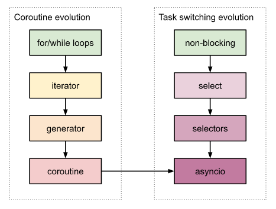

# Эволюция игрового фреймворка. Сервер 7. Сопрограммы в Python

Как известно, если хочешь что-то понять, найди сначала тот начальный момент, из которого это что-то появилось. Зри в корень, как говорил Козьма Прутков. А найдя корень, проследи всю его эволюцию до настоящего времени. То, как она протекала, и почему именно таким образом. Хотя если понимать не обязательно, а нужно только делать, то можно и не разбираться.

Поскольку асинхронность в Python реализована через сопрограммы, или корутины (coroutines), сопрограммы произошли из генераторов, генераторы появились из итераторов, а итераторы были созданы для перебора последовательности, то начнем с перебора последовательности и пройдем всю приведенную цепочку в обратном направлении.



## Итерирование

Проще всего последовательность (в частности, массивы, или, как они называются в Python, списки (list)) можно перебрать, обращаясь к каждому элементу по индексу. Индекс всегда начинается с 0 и заканчивается длиной минус 1:

```python
def print_items(items):
    i, total = 0, len(items)
    while i < total:
        print(items[i])
        i += 1
```

В данном примере алгоритм перебора (итерирования) элементов прямо встроен в функцию, и чтобы поменять алгоритм, нужно изменить саму функцию. Например, если мы захотим вывести элементы списка в обратном порядке, то нам придется создать новую функцию, где 3 из 4-х строк будут измененными, хотя назначение ее — вывод элементов на экран — остается прежним:

```python
def print_items_reversed(items):
    i = len(items) - 1
    while i >= 0:
        print(items[i])
        i -= 1
```

## Итераторы

Для того, чтобы отделить алгоритм итерирования от основного назначения данной функции (`print(items[i])`), введем новую сущность — [итератор](https://docs.python.org/3/glossary.html#term-iterator). Она предоставляет единый интерфейс для доступа к следующему элементу, а конкретная реализация итератора уже сама решает какой элемент в действительности нужно отдавать:

```python
class Iterator:
    def __init__(self, items):
        self.items = items
        self.i = 0
        self.count = len(items) if items else 0

    def next(self):
        if self.i >= self.count:
            raise Exception()
        item = self.items[self.i]
        self.i += 1
        return item

class ReverseIterator(Iterator):
    def next(self):
        if self.i >= self.count:
            raise Exception()
        item = self.items[self.count - 1 - self.i]
        self.i += 1
        return item
```

В результате у нас получается единственное назначение у функции — вывод элементов, а то в каком порядке они будут выводится — в прямом или обратном — зависит от объекта итератора, переданного ей в качестве аргумента:

```python
def print_items(iterator):
    while True:
        try:
            print(iterator.next())
        except:
            break
```

Разработчики Python пошли дальше и ввели итераторы как одну из ключевых концепций языка. Так, метод next() становится магическим: __next__(), каждый объект с таким методом — итератором, а цикл for-in теперь автоматически вызывает __next__() при каждой итерации. Завершается цикл только тогда, когда итератор сгенерирует специальное исключение StopIteration. Вне цикла for-in получить следующие значения итератора (то есть вызвать метод __next__()) можно специальной функцией next():

```python
for item in iterator:
	print(item)
# Same as:
while True:
	try:
		print(next(iterator))
	except StopIterator:
		break
```

Не правда ли такая запись (```for item in iterator:```) гораздо легче воспринимается и быстрее пишется, чем ```for (i=0; i < len(l); i++) item = l[i]```.

Чтобы в цикле можно было использовать последовательности точно так же, как и итераторы, и в те и в другие добавляется еще один магический метод — __iter__(), создающий итератор. При этом цикл for-in всегда сначала вызывает __iter__() у переданного ему объекта, и только потом начинает перебирать элементы возвращенного итератора. Если уже был передан итератор, то его __iter__() возвращает ссылку на самого себя:

```python
for item in items:
	print(item)

class list:
	# ...
    def __iter__(self):
    	return Iterator(self)

class Iterator:
	# ...
    def __iter__(self):
    	return self
```

Таким образом, цикл for в Python работает только с итераторами. Если других языка итераторы — лишь один из допустимых паттернов проектирования, то в Python — это обязательная, неотъемлемая часть языка.

В итоге образуется новый тип итерируемых объектов ([Iterable](https://docs.python.org/3/library/collections.abc.html?highlight=container#collections.abc.Iterable)), в который входят и контейнеры элементов ([Container](https://docs.python.org/3/library/collections.abc.html#collections.abc.Container)), и итераторы ([Iterator](https://docs.python.org/3/library/collections.abc.html?highlight=container#collections.abc.Iterator)). Чтобы быть итерируемым, объект должен содержать метод __iter__(). А генераторы должны еще иметь и __next__().

Типичный итератор списка будет выглядеть примерно так:

```python
class Iterator:
    def __init__(self, items):
        self.items = items
        self.i = 0
        self.count = len(items) if items else 0

    def __iter__(self):
    	return self

    def __next__(self):
        if self.i >= self.count:
            raise StopIteration()
        item = self.items[self.i]
        self.i += 1
        return item

iterator = Iterator([1, 2, 3])
for item in iterator:
	print(item)
```

## Генераторы

Однако, время от времени нам все же нет-нет да и нужно делать перебор индексов — чисел от 0 до n - 1 включительно. Для этих целей создается итератор, не проходящийся по элементам существующей последовательности, а генерирующий значения на лету:

```python
# C:
# for (int i = 0; i < 10; i++);
# Python:
for i in range(10):
	pass
```

С этого момента простой цикл for становится ненужным, так как он легко может быть заменен for-in + range(). Поэтому он и был удален из языка. Ведь согласно 13 пункту [Дзена Python](https://peps.python.org/pep-0020/) должен быть один и, желательно, только один очевидный способ сделать что-либо.

Итератор range() можно использовать и тогда, когда нужны и индексы и сами элементы последовательности. Хотя в таких случаях удобнее использовать другой итератор — enumerate():

```python
for i in range(len(items)):
	item = items[i]
	print(i, item)
# Same, but better
for i, item in enumerate(items):
	print(i, item)
```

Вот как `range()` можно реализовать:

```python
# As iterator
class range:
    def __init__(self, count):
        self.i = 0
        self.count = count

    def __iter__(self):
    	return self

    def __next__(self):
        if self.i >= self.count:
            raise StopIteration()
		i = self.i
        self.i += 1
        return i
```

В сущности, это уже не итератор, а генератор. Ведь он не перебирает (итерирует) элементы последовательности, а создает их на ходу. Генератор позволяет создавать элементы последовательности без необходимости хранить всю последовательность в памяти. В отличие от обычного итератора.

В Python понятие генератора выделилось из итератора в отдельную сущность языка. Внешне он выглядит, как функция, но от последней отличается присутствием инструкции yield. Наличие хотя бы одного yield говорит, что это уже не функция, а генератор.

Благодаря этому код из примера выше можно представить в более коротком и элегантном виде:

```python
# Same as generator
def range(count):
    i = 0
    while True:
        if i >= count:
            return  # Will raise StopIteration() in next()
        yield i
        i += 1
```

В отличие от функции вызов генератора не начнет выполнение внутреннего кода, а создаст объект генераторного итератора ([generator iterator](https://docs.python.org/3/glossary.html#term-generator-iterator)). Чтобы начать выполнение нужно начать этот итератор итерировать: поместить в цикл for-in или вызвать функцию next():

```python
for i in range(5):
	print(i)

r = range(5)
print(next(r))
print(next(r))
```

Генератор — это по сути другая форма записи итератора — в виде функции с ключевым словом yield вместо return. Каждый экземпляр генераторного итератора, можно понимать как функцию с состоянием. Так, если обычная функция начинается каждый раз заново, то генератор продолжает выполнение с инструкции, следующей после последнего возвращенного yield.

В приведенном выше примере после вызова yield выполнение генератора прерывается, а после очередного вызова next() — возобновляется с того же места. И так происходит до тех пор, пока не будет вызван return или не произойдет выход из генератора (что эквивалентно return None). В обоих случаях генерируется уже известное нам исключение StopIteration. Это означает, что данный итератор больше итерироваться не будет, и нужно создавать новый.

## Вложенные генераторы

Генераторы могут быть вложенными, то есть использовать внутри себя другие генераторы. Вот пример бесконечного генератора факториала, использующего внутри себя бесконечный генератор натуральных чисел:

```python
def infinite_counter():
    i = 1
    while True:
        yield i
        i += 1

def factorial():
    result = 1
    for i in infinite_counter():
        result *= i
        yield result

gen = factorial()
while True:
	print(next(gen))
	input("Press Enter to get next value")
```

Тут вложенный генератор просто используется внутри другого и снаружи никак не заметен. Но бывают случаи, когда нужно значения из вложенного генератора передавать наружу напрямую:

```python
def counter(n):
    print("Counter")
    i = 1
    while True:
        yield i
        i += 1
        if i > n:
            print("Counter End")
            return

def counter2(n):
    print("Wrapper2")
    for i in counter(n):
        yield i
    print("Wrapper2 End")

def counter3(n):
    print("Wrapper3")
    yield from counter(n)
    print("Wrapper3 End")

print()
for i in counter(5):
    print(i)
print()
for i in counter2(5):
    print(i)
print()
for i in counter3(5):
    print(i)
```

Тут все три генератора возвращают один и тот же результат: 1, 2, 3, 4, 5. Но делают они это по-разному:
 - counter — это обычный генератор натуральных чисел, который будет использоваться как вложенный;
 - counter2 — генератор-обертка, которая просто перебирает элементы counter() и просто ретранслирует значения наружу;
 - counter3 — это то же самое, что и counter2, только с "синтаксическим сахаром" yield from, который эквивалентен использованию for-in + yield, как в counter2.

Эквивалентен, да не эквивалентен. Есть у него одно отличие. Когда из некоего `outer_gen` вызывается `yield from inner_gen`, устанавливается поле `outer_gen.gi_yieldfrom = inner_gen`. Каждый вызов `next(outer_gen)`, если его поле `gi_yieldfrom` не равно `None`, будет в действительности вызывать `next(outer_gen.gi_yieldfrom)`. То есть в нашем случае `next(inner_gen)`. И это будет происходить до тех пор, пока внутренний генератор не завершится.

Таким образом, с помощью yield from генератор фактически делегирует дальнейшее выполнение программы своему внутреннему генератору, а сам на это время как бы самоустраняется. Более наглядно это может продемонстрировать следующим примером, который также выводит числа 1, 2, 3, 4, 5:

```python
def outer():
    yield 1
    yield from inner()
    yield 4

def inner():
    yield 2
    yield 3

for i in outer():
    print(i)
```

## Переход к сопрограммам

На таких простых примерах пока что не имеет значения — использовать yield from или for-in + yield. Но когда мы будем применять генераторы как сопрограммы (корутины), нам уже без yield from не обойтись. Данная конструкция будет автоматически перенаправлять нас к последней запускавшейся внутренней сопрограмме, на каком бы уровне вложенности она ни находилась. Ниже простой тому пример.

Но прежде нужно рассмотреть еще одно нововведение. Изначально генераторы могли только возвращать данные наружу (yield), но не получать их извне. Чтобы устранить этот недостаток в генератор был введен метод send(), который работает следующим образом:

```python
def counter(n):
    print("Counter")
    i = 1
    while True:
        x = yield i
        if x is not None:
            i = int(x)
        i += 1
        if i > n:
            print("Counter End")
            return

gen = counter(7)
print(next(gen))
print(gen.send(None))  # Same as next(gen)
print(gen.send(4))  # OK
for i in gen:  # Print the rest
    print(i)
```

Метод send() передает свой аргумент выражению yield, так что переменная, которой оно присваивается, получает значение аргумента send(). После этого продолжается обычное выполнение, как если бы был вызван просто next() (next() включен в send()). В примере выше скрипт вернет такие значения:
 - 1 (первый вызов next(gen)),
 - 2 (вызов gen.send(None), который эквивалентен next(gen)),
 - 5 (т.к. x=4, полученный от gen.send(4), после чего выполняются: i=x (4), i += 1 (5), yield i (5)).
Остальные 6, 7 выведутся в завершающем цикле ```for i in gen:```.

Так вот, если мы выполним то же самое с обертками counter2 и counter3, то gen.send(4) для counter3, где используется yield from, будет работать так же, как и для counter.

```python
def counter2(n):
    print("Wrapper2")
    for i in counter(n):
        yield i
    print("Wrapper2 End")


def counter3(n):
    print("Wrapper3")
    yield from counter(n)
    print("Wrapper3 End")

for gen in [counter2(7), counter3(7)]:
	print(next(gen))
	print(gen.send(None))  # Same as next(gen)
	print(gen.send(4))  # OK for counter3, fail for counter2
	for i in gen:  # Print the rest
		print(i)
# 1,2,3,4,5,6,7 for counter2
# 1,2,5,6,7 for counter3 - same as for counter
```

И это не удивительно, ведь send() будет фактически перенаправлен в counter через поле gi_yieldfrom. Во втором случае counter используется опосредованно и 4-ка до него не дойдет. Чтобы counter2 работал, как counter, его придется значительным образом переделывать. Поэтому, чтобы не морочить себе голову, и был введен синтаксический сахар yield from, который, как мы увидели, не просто синтаксический сахар, но вполне полноценное нововведение.

Фактически уже на этом этапе мы из генераторов получили настоящие корутины (сопрограммы). Цепочка вложенных вызовов yield from (благодаря полю gi_yieldfrom) позволяет нам мгновенно выходить и возвращаться в корутину на любом уровне вложенности, а использование send() вместо next() дает возможность пересылать в нее данные (если это нужно, конечно).

Применение генераторов как сопрограмм нам пригодится в реализации асинхронности. Для настоящей асинхронности не хватает только цикла с переключением между сопрограммами, для чего мы задействуем [Selector](02_server_06.md). А как именно это будет происходить, будет рассказано [ниже](02_server_08.md).

Подробнее:
[How do Python Generators Work? Internals of the CPython Interpreter](https://towardsdatascience.com/cpython-internals-how-do-generators-work-ba1c4405b4bc)

[Исходники](https://gitlab.com/markelov-alex/hx-py-framework-evolution/-/tree/main/f_models/server_socket/v0/async/)

[< Назад](02_server_06.md)  |  [Начало](00_intro_01.md)  |  [Вперед >](02_server_08.md)
